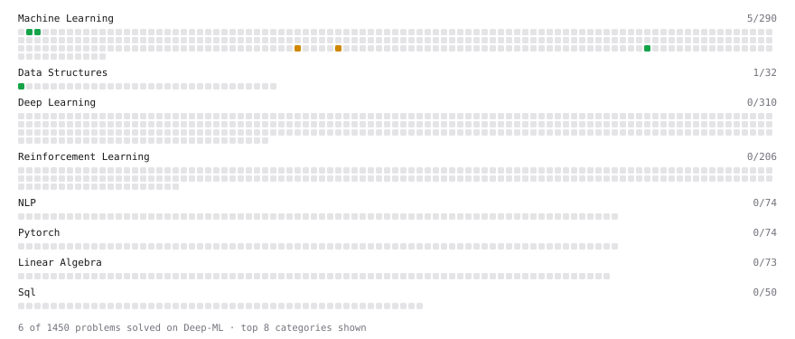

# Deep-ML

My machine learning practice from [Deep-ML](https://www.deep-ml.com). Every solution here was written by hand.

**17** solved · 12 problems · 0 labs · 5 math

[**Browse the interactive portfolio**](https://solo938.github.io/deep-ml/) to replay this filling in over time.

## Problems

| | Difficulty | Solved | |
| --- | --- | --- | --- |
| [Calculate Mean Absolute Error (MAE)](https://www.deep-ml.com/problems/93) | easy | 2026-09-26 | [solution](problems/0093-calculate-mean-absolute-error-mae) |
| [Calculate R-squared for Regression Analysis](https://www.deep-ml.com/problems/69) | easy | 2026-09-26 | [solution](problems/0069-calculate-r-squared-for-regression-analysis) |
| [Calculate Root Mean Square Error (RMSE)](https://www.deep-ml.com/problems/71) | easy | 2026-09-26 | [solution](problems/0071-calculate-root-mean-square-error-rmse) |
| [Feature Scaling Implementation](https://www.deep-ml.com/problems/16) | easy | 2026-09-24 | [solution](problems/0016-feature-scaling-implementation) |
| [Linear Regression Using Gradient Descent](https://www.deep-ml.com/problems/15) | easy | 2026-09-26 | [solution](problems/0015-linear-regression-using-gradient-descent) |
| [Min-Max Scaling of Feature Values](https://www.deep-ml.com/problems/112) | easy | 2026-09-24 | [solution](problems/0112-min-max-scaling-of-feature-values) |
| [Random Train/Validation/Test Split with Shuffling](https://www.deep-ml.com/problems/1058) | easy | 2026-09-24 | [solution](problems/1058-random-train-validation-test-split-with-shuffling) |
| [Dummy Classifier Baseline](https://www.deep-ml.com/problems/847) | medium | 2026-09-26 | [solution](problems/0847-dummy-classifier-baseline) |
| [Dummy Regressor Baseline](https://www.deep-ml.com/problems/848) | medium | 2026-09-26 | [solution](problems/0848-dummy-regressor-baseline) |
| [Mini-Batch Gradient Descent Step for Linear Regression](https://www.deep-ml.com/problems/803) | medium | 2026-09-26 | [solution](problems/0803-mini-batch-gradient-descent-step-for-linear-regression) |
| [StandardScaler Fit and Transform](https://www.deep-ml.com/problems/842) | medium | 2026-09-24 | [solution](problems/0842-standardscaler-fit-and-transform) |
| [Stochastic Gradient Descent Step for Linear Regression](https://www.deep-ml.com/problems/802) | medium | 2026-09-26 | [solution](problems/0802-stochastic-gradient-descent-step-for-linear-regression) |

## Math

| | Difficulty | Solved | |
| --- | --- | --- | --- |
| [Descriptive Statistics](https://www.deep-ml.com/math-problems/18) | easy | 2026-09-24 | [solution](math/0018-descriptive-statistics) |
| [Expectation and Variance Algebra](https://www.deep-ml.com/math-problems/33) | easy | 2026-09-24 | [solution](math/0033-expectation-and-variance-algebra) |
| [Gradient Descent Updates](https://www.deep-ml.com/math-problems/5) | easy | 2026-09-24 | [solution](math/0005-gradient-descent-updates) |
| [ML Workflow Basics](https://www.deep-ml.com/math-problems/30) | easy | 2026-09-24 | [solution](math/0030-ml-workflow-basics) |
| [Least Squares and the Normal Equations](https://www.deep-ml.com/math-problems/34) | medium | 2026-09-24 | [solution](math/0034-least-squares-and-the-normal-equations) |

---

_This file is regenerated by Deep-ML on every push._
